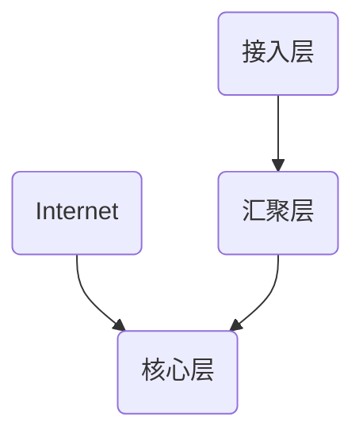

# nsd1907_review_day02

## 网络架构

- 核心层：连接外网
- 汇聚层：负责vlan间通信，将数据转发至核心层
- 接入层：负责将终端主机、服务器接入网络

VLAN和IP地址规划：

1教室：vlan1 / 192.168.1.0/24

2教室：vlan2 / 192.168.2.0/24

... ...

10教室：vlan10 / 192.168.10.0/24

办公区1：vlan101 / 192.168.101.0/24

