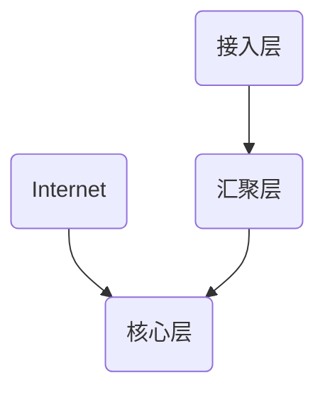

# nsd1907_review_day02

## 网络架构

- 核心层：连接外网
- 汇聚层：负责vlan间通信，将数据转发至核心层
- 接入层：负责将终端主机、服务器接入网络



VLAN和IP地址规划：

1教室：vlan1 / 192.168.1.0/24

2教室：vlan2 / 192.168.2.0/24

... ...

10教室：vlan10 / 192.168.10.0/24

办公区1：vlan101 / 192.168.101.0/24


汇聚层：

- 创建vlan
- 中继：实现不同交换机上的相同vlan通信。封装协议采用ieee 802.1q
- 聚合链路、以太通道
- 为了实现不同VLAN互相通信，还需要配置三层交换

回答问题的方式：nW1H => What是什么？Why为什么要用？When什么时候用？Where在哪用？How怎么用？

什么是vlan？ vlan是虚拟局域网。在大型平面网络中，为了实现广播控制引入了vlan。可以根据功能或部门等创建vlan，再把相关的端口加入到vlan。为了实现不同交换机上的相同VLAN通信，需要配置中继。为了实现不同VLAN间的通信，需要配置三层交换。

IP地址：ipv4，32位2进制数，以点分10进制进行表示，IP地址分类

私有地址：10.0.0.0/8  172.16.0.0-172.31.0.0/16  192.168.0.0-192.168.255.0/24

静态路由、缺省路由。VRRP虚拟冗余路由协议，ACL、NAT。

三次握手：

```sequence
A->B: syn=1
B->A: ack=1/sync=1
A->B: ack=1
```

抓包

```shell
# yum install -y wireshark-gnome
```


服务类项目

《大型网站技术架构》阿里 李智慧

IBM：小型机

Oracle：数据库

EMC：存储


RAID: 级别、性能、容错、构成、利用率

RAID0：性能最高、无容错、2块以上、100％

RAID1：性能无提升、容错级别最高、2块（以上）、50％

RAID5：相当于是RAID0和1的折中

RAID6：有两块盘的空间做容错

RAID10：RAID1＋RAID0


keepalived双主


