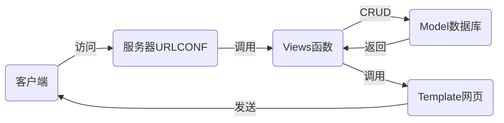

# nsd_1908_devweb_day03

## 常用的web框架

- django
- flask
- tornado

## MTV模式

- Model：模型，对应数据库
- Template：模板，对应web页面
- View：视图，对应函数



## 在虚拟环境中安装django

```python
# 本地安装
(nsd1908) [root@room8pc16 day03]# pip install /var/ftp/pub/zzg_pypkgs/dj_pkgs/*

# 在线安装
(nsd1908) [root@room8pc16 day03]# pip install django==
(nsd1908) [root@room8pc16 day03]# pip install django==1.11.6
```

## 创建项目

- 一个项目由很多文件构成，一般将这些文件统一放到一个目录中

```python
# 创建项目，方法一：
(nsd1908) [root@room8pc16 day03]# django-admin startproject mytest
(nsd1908) [root@room8pc16 day03]# ls
mytest  

# 创建项目，方法二：pycharm
# File -> New Project -> 左窗格点django，右窗格输入项目目录/xxx/mysite

(nsd1908) [root@room8pc16 mysite]# pwd
/var/ftp/nsd2019/nsd1908/devweb/day03/mysite  # 项目的根目录
(nsd1908) [root@room8pc16 mysite]# tree .
.
├── manage.py             # 项目管理程序
├── mysite                # 项目配置目录
│   ├── __init__.py       # 初始化文件
│   ├── settings.py       # 项目的配置文件
│   ├── urls.py           # urlconf路由文件
│   └── wsgi.py           # 部署项目到服务器的配置文件
└── templates             # 模板目录，存放网页的目录

# 启动开发服务器。django为方便程序员看到代码效果，它内置了一个测试服务器，该服务器只能用于开发环境，不能用于生产环境。
(nsd1908) [root@room8pc16 mysite]# python manage.py runserver
# 访问 http://127.0.0.1:8000
```


