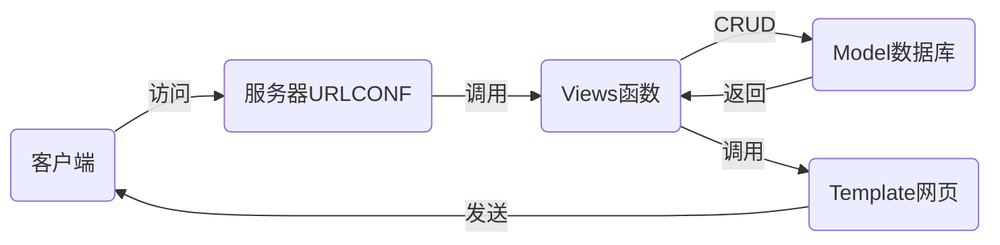

# nsd_1908_devweb_day03

## 常用的web框架

- django
- flask
- tornado

## MTV模式

- Model：模型，对应数据库
- Template：模板，对应web页面
- View：视图，对应函数



## 在虚拟环境中安装django

```python
# 本地安装
(nsd1908) [root@room8pc16 day03]# pip install /var/ftp/pub/zzg_pypkgs/dj_pkgs/*

# 在线安装
(nsd1908) [root@room8pc16 day03]# pip install django==
(nsd1908) [root@room8pc16 day03]# pip install django==1.11.6
```

## 创建项目

- 一个项目由很多文件构成，一般将这些文件统一放到一个目录中

```python
# 创建项目，方法一：
(nsd1908) [root@room8pc16 day03]# django-admin startproject mytest
(nsd1908) [root@room8pc16 day03]# ls
mytest  

# 创建项目，方法二：pycharm
# File -> New Project -> 左窗格点django，右窗格输入项目目录/xxx/mysite

(nsd1908) [root@room8pc16 mysite]# pwd
/var/ftp/nsd2019/nsd1908/devweb/day03/mysite  # 项目的根目录
(nsd1908) [root@room8pc16 mysite]# tree .
.
├── manage.py             # 项目管理程序
├── mysite                # 项目配置目录
│   ├── __init__.py       # 初始化文件
│   ├── settings.py       # 项目的配置文件
│   ├── urls.py           # urlconf路由文件
│   └── wsgi.py           # 部署项目到服务器的配置文件
└── templates             # 模板目录，存放网页的目录

# 启动开发服务器。django为方便程序员看到代码效果，它内置了一个测试服务器，该服务器只能用于开发环境，不能用于生产环境。
(nsd1908) [root@room8pc16 mysite]# python manage.py runserver
# 访问 http://127.0.0.1:8000
```

## 修改配置

```python
# 创建数据库
[root@room8pc16 ~]# mysql -uroot -ptedu.cn
MariaDB [(none)]> CREATE DATABASE dj1908 DEFAULT CHARSET utf8;

# mysite/settings.py
ALLOWED_HOSTS = ['*']   # 允许任意主机访问本机的任何地址
DATABASES = {
    'default': {
        'ENGINE': 'django.db.backends.mysql',
        'NAME': 'dj1908',
        'USER': 'root',
        'PASSWORD': 'tedu.cn',
        'HOST': '127.0.0.1',
        'PORT': '3306',
    }
}
LANGUAGE_CODE = 'zh-hans'
TIME_ZONE = 'Asia/Shanghai'
USE_TZ = False

# 配置到mysql的连接
import pymysql

pymysql.install_as_MySQLdb()

# 重新运行开发服务器，运行在0.0.0.0的80端口
(nsd1908) [root@room8pc16 mysite]# python manage.py runserver 0:80


# 生成后台数据库表
(nsd1908) [root@room8pc16 mysite]# python manage.py makemigrations
(nsd1908) [root@room8pc16 mysite]# python manage.py migrate

# 创建管理员用户
(nsd1908) [root@room8pc16 mysite]# python manage.py createsuperuser
Username (leave blank to use 'root'): admin
Email address: admin@tedu.cn
Password: 1234.com

# 访问后台管理页面：http://127.0.0.1/admin

```

## 创建应用

- 应用就是一个功能模块
- 每个应用对应一个目录
- 一个项目可以包一到多个应用
- 一个应用也可以应用到多个项目

### 投票应用

#### 规划

- http://127.0.0.1:8000/polls/：投票首页，显示所有的投票项
- http://127.0.0.1:8000/polls/1/：1号问题投票详情，可以投票
- http://127.0.0.1:8000/polls/1/result/：1号问题投票结果页

```python
# 创建应用
(nsd1908) [root@room8pc16 mysite]# python manage.py startapp polls
(nsd1908) [root@room8pc16 mysite]# ls
db.sqlite3  manage.py  mysite  polls  templates

# 将应用加入到mysite项目
# mysite/settings.py
INSTALLED_APPS = [
    ... ...
    'polls',
]
```

授权：将应用的url交给应用处理

```python
# 以polls开头的url交给polls应用处理
# mysite/urls.py
from django.conf.urls import url, include
from django.contrib import admin

urlpatterns = [
    url(r'^admin/', admin.site.urls),
    # 从http://x.x.x.x/之后开始匹配
    url(r'^polls/', include('polls.urls')),
]

# 创建polls/urls.py
from django.conf.urls import url

urlpatterns = []

```


