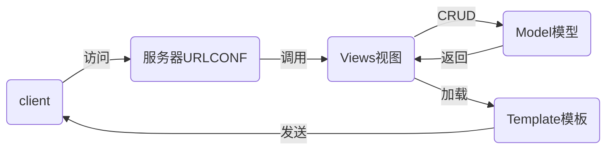

# NSD1909_DEVWEB_DAY04

## 注意：有问题，在群中直接找项目经理

### 今日内容：

1. 介绍vmware虚拟机的使用
2. 配置环境
3. django

## 配置环境

```shell
# 安装python
[root@localhost ~]# tar xf zzg_pypkgs.tar.gz
[root@localhost ~]# cd zzg_pypkgs/
[root@localhost ~]# cd python3_pkg/
[root@localhost ~]# vim README
yum install -y sqlite-devel tk-devel tcl-devel readline-devel zlib-devel gcc gcc-c++ openssl-devel libffi-devel
tar xzf Python-3.6.7.tgz
cd Python-3.6.7
./configure --prefix=/usr/local/
make && make install
[root@localhost ~]# bash README

# 实现按tab键补全功能：https://www.jianshu.com/p/b83a803cfc86

# 创建虚拟环境
[root@localhost ~]# python3 -m venv ~/nsd1908

# 激活虚拟环境，并安装相应的软件包
[root@localhost ~]# source ~/nsd1908/bin/activate
(nsd1908) [root@localhost ~]# pip install django==
(nsd1908) [root@localhost ~]# pip install django==1.11.6
(nsd1908) [root@localhost ~]# pip install pymysql
```

## pycharm配置

```shell
# 配置pycharm。注意：需要java
(nsd1908) [root@localhost cloud5]# mkdir ~/bin
(nsd1908) [root@localhost cloud5]# tar xf pycharm2017.tar.gz -C ~/bin/

# 打开一个新的终端，运行破解工具
[root@localhost ~]# /root/bin/crack &

# 配置菜单，在菜单中添加pycharm
[root@localhost bin]# yum install -y alacarte
# 应用程序->杂项->主菜单
# 选择“主菜单”窗口中的 应用程序->编程，在右窗格点“新建项目”
# Name: PyCharm2017   Command: /root/bin/pycharm2017/bin/pycharm.sh
# 点击图标，更换为：/root/bin/pycharm2017/bin/pycharm.png

# 启动pycharm2017后，激活时，Lisence Server为http://127.0.0.1:1017
```

## DJANGO

### MTV

M: Model模型，对应数据库

T：Template模板，对应网页

V：View视图，对应函数



### 在pycharm中创建django项目

新建项目->左空格选择django项目，右窗格指定项目路径为/xxx/xxx/mysite。下面的解释器要改为/root/nsd1908/bin/python

```python
(nsd1908) [root@room8pc16 mysite]# tree .
.
├── manage.py             # 项目管理程序
├── mysite                # 项目配置目录
│   ├── __init__.py       # 初始化文件
│   ├── settings.py       # 项目的配置文件
│   ├── urls.py           # urlconf路由文件
│   └── wsgi.py           # 部署项目到服务器的配置文件
└── templates             # 模板目录，存放网页的目录
```

### 配置django项目

```python
# 配置数据库
[root@localhost cloud5]# yum install -y mariadb-server
[root@localhost cloud5]# systemctl start mariadb
[root@localhost cloud5]# systemctl enable mariadb

# 修改密码
[root@localhost cloud5]# mysqladmin password tedu.cn

# 创建数据库
[root@localhost cloud5]# mysql -uroot -ptedu.cn
MariaDB [(none)]> CREATE DATABASE nsd1908 DEFAULT CHARSET utf8;

# 配置django可以使用pymysql模块： mysite/__init__.py
import pymysql

pymysql.install_as_MySQLdb()

# 修改django项目配置： mysite/settings.py
ALLOWED_HOSTS = ['*']   # 允许用户可以通过所有地址访问
DATABASES = {
    'default': {
        'ENGINE': 'django.db.backends.mysql',
        'NAME': 'nsd1908',
        'USER': 'root',
        'PASSWORD': 'tedu.cn',
        'HOST': '127.0.0.1',
        'PORT': '3306',
    }
}
LANGUAGE_CODE = 'zh-hans'
TIME_ZONE = 'Asia/Shanghai'
USE_TZ = False

# 启动开发服务器测试，服务器运行在0.0.0.0的80端口
(nsd1908) [root@localhost mysite]# python manage.py runserver 0:80
# 访问http://127.0.0.1/

# 为django项目中默认的应用生成数据库表
(nsd1908) [root@localhost mysite]# python manage.py makemigrations
(nsd1908) [root@localhost mysite]# python manage.py migrate

# 创建管理员用户
(nsd1908) [root@localhost mysite]# python manage.py createsuperuser
Username (leave blank to use 'root'): admin
Email address: admin@tedu.cn
Password: 1234.com
Password (again): 1234.com

# 重新启动开发服务器
(nsd1908) [root@localhost mysite]# python manage.py runserver 0:80
# 访问管理后台：http://127.0.0.1/admin
```

## 配置应用

### 创建一个投票应用

```python
# 创建应用
(nsd1908) [root@localhost mysite]# python manage.py startapp polls
(nsd1908) [root@localhost mysite]# ls
manage.py  mysite  polls  templates

# 集成polls应用到项目
# mysite/settings.py
INSTALLED_APPS = [
    ... ...
    'polls',
]
```

### 投票应用的规划

- http://127.0.0.1/polls/：投票首页，显示所有的投票项
- http://127.0.0.1/polls/1/：1号问题的投票详情，可以进行投票
- http://127.0.0.1/polls/1/result/：1号问题的投票结果

### 完成应用

1. 授权，将应用的url交给应用处理

```python
# mysite/urls.py
from django.conf.urls import url, include
from django.contrib import admin

urlpatterns = [
    url(r'^admin/', admin.site.urls),
    url(r'^polls/', include('polls.urls')),
]

# polls/urls.py
from django.conf.urls import url

urlpatterns = []
```

2. 制作投票首页
```python
# 1. 创建路由映射
# polls/urls.py
from django.conf.urls import url
from . import views  # 从当前目录导入views模块

urlpatterns = [
    # 用户访问http://x.x.x.x/polls/时，使用index函数响应，为该url起名为index
    url(r'^$', views.index, name='index'),
]

# 2. 创建视图函数
# polls/views.py
from django.shortcuts import render

# 每个函数至少需要一个参数，用于接收用户发来的请求
def index(request):
    return render(request, 'index.html')

# 3. 创建模板文件
# templates/index.html
<!DOCTYPE html>
<html lang="en">
<head>
    <meta charset="UTF-8">
    <title>投票首页</title>
</head>
<body>
<h1>投票首页</h1>
</body>
</html>

# 4. 访问http://127.0.0.1/polls/进行测试
```

2. 制作投票详情页

```python
# 1. polls/urls.py
from django.conf.urls import url
from . import views  # 从当前目录导入views模块

urlpatterns = [
    # 用户访问http://x.x.x.x/polls/时，使用index函数响应，为该url起名为index
    url(r'^$', views.index, name='index'),
    # 将url中的数字用\d+匹配，再通过()将其作为参数传递给detail函数
    url(r'^(\d+)/$', views.detail, name='detail'),
]

# 2. polls/views.py
... ...
def detail(request, question_id):
    # 字典的内容将转换成question_id=nn传给detail.html，作为它可以使用的变量
    return render(request, 'detail.html', {'question_id': question_id})

# 3. templates/detail.html
<!DOCTYPE html>
<html lang="en">
<head>
    <meta charset="UTF-8">
    <title>投票详情</title>
</head>
<body>
<h1>{{ question_id }}号问题的投票详情</h1>
</body>
</html>

# 4. 访问http://x.x.x.x/polls/数字
```

3. 制作投票结果页

```python
# 1. polls/urls.py
... ...
    url(r'^(\d+)/result/$', views.result, name='result'),
... ...

# 2. polls/views.py
... ...
def result(request, question_id):
    return render(request, 'result.html', {'question_id': question_id})

# 3. templates/result.html
<!DOCTYPE html>
<html lang="en">
<head>
    <meta charset="UTF-8">
    <title>投票结果</title>
</head>
<body>
<h1>{{ question_id }}号问题投票结果</h1>
</body>
</html>

# 4. 访问访问http://x.x.x.x/polls/数字/result
```

## 编写模型

模型对应的是数据库，投票应用需要用到的字段：问题、发布时间、选项、选项所得票数

需要两个模型（表）：

- 问题表：问题内容、发布时间
- 选项表：选项、票数、问题

### ORM对象关系映射

Object：对象

Relationship：关系

Mapper：映射

- 数据库的表与django的class映射
- 表的字段与class的类变量映射
- 表中的记录与类的实例映射
- 数据库的数据类型与django内部的相应的类映射

### 创建模型

```python
# polls/models.py
from django.db import models

class Question(models.Model):
    question_text = models.CharField(max_length=200)
    pub_date = models.DateTimeField()

class Choice(models.Model):
    choice_text = models.CharField(max_length=200)
    votes = models.IntegerField(default=0)
    q = models.ForeignKey(Question)

# 生成表
(nsd1908) [root@localhost mysite]# python manage.py makemigrations
(nsd1908) [root@localhost mysite]# python manage.py migrate

# 分析表名：表名是 应用名_类名   全部采用小写
MariaDB [nsd1908]> show tables;
... ...
| polls_choice               |
| polls_question             |

# 分析表结构：
MariaDB [nsd1908]> desc polls_question;
MariaDB [nsd1908]> desc polls_choice;
# 如果模型中没有明确定义主键，django将自动创建一个名为id的主键

# Choice模型中的q是外键，数据库的表将创建名为q_id的外键。如果将q改为question，那么数据库中的外键，将会变为question_id
# polls/models.py
... ...
class Choice(models.Model):
    choice_text = models.CharField(max_length=200)
    votes = models.IntegerField(default=0)
    question = models.ForeignKey(Question)

(nsd1908) [root@localhost mysite]# python manage.py makemigrations
Did you rename choice.q to choice.question (a ForeignKey)? [y/N] y
(nsd1908) [root@localhost mysite]# python manage.py migrate

MariaDB [nsd1908]> desc polls_choice;

# 将模型注册到后台管理界面
# polls/admin.py
from django.contrib import admin
from .models import Question, Choice  # 从当前目录下的models中导入模型

# Register your models here.
admin.site.register(Question)
admin.site.register(Choice)
# 访问后台管理界面：http://127.0.0.1/admin

# 后台管理界面中添加问题后，问题全部显示为Question object，添加的选项全部显示为Choice object
# 修复该问题的方法如下：
from django.db import models

class Question(models.Model):
    question_text = models.CharField(max_length=200)
    pub_date = models.DateTimeField()
    
    def __str__(self):
        return "问题: %s" % self.question_text

class Choice(models.Model):
    choice_text = models.CharField(max_length=200)
    votes = models.IntegerField(default=0)
    question = models.ForeignKey(Question)
    
    def __str__(self):
        return "%s=>%s" % (self.question, self.choice_text)

```

## 操作模型

### 增加记录

```python
# 进入python shell
(nsd1908) [root@localhost mysite]# python manage.py shell
>>> from polls.models import Question, Choice

# 创建问题方法一：
# django为每个模型都创建了一个名为objects的管理器，我们可以通过该管理器对模型实现各种操作
# 在数据库中取出问题，如果问题不存在则创建
>>> r1 = Question.objects.get_or_create(question_text="你喜欢吃什么?", pub_date='2020-2-5')
>>> type(r1)
<class 'tuple'>
>>> r1  # 元组第一项是问题实例，第二项是True或False
(<Question: 问题: 你喜欢吃什么?>, True)
>>> q1 = r1[0]
>>> q1.id
3
>>> q1.question_text
'你喜欢吃什么?'
>>> q1.pub_date
'2020-2-5'

# 创建问题，方法以二：直接创建实例
>>> q2 = Question(question_text="你一天吃几顿饭？", pub_date='2020-2-2')
>>> q2.save()


# 创建选项，方法一，通过objectes管理器：
>>> c1 = Choice.objects.get_or_create(choice_text="红烧肉", question=q1)[0]
>>> c1
<Choice: 问题: 你喜欢吃什么?=>红烧肉>

# 创建选项，方法二，创建实例：
>>> c2 = Choice(choice_text="方便面", question=q1)
>>> c2.save()

# 创建选项，方法三，直接通过问题实例创建选项
# 因为每个问题都可以有很多选项，选项模型名为Choice，那么每个问题的实例都有一个名为choice_set的管理器(如果模型名为xuanxiang，那么管理器就叫xuanxiang_set)，与objects类似，可以通过choice_set为问题创建选项
>>> c3 = q1.choice_set.get_or_create(choice_text="烤鸭")[0]
>>> c3
<Choice: 问题: 你喜欢吃什么?=>烤鸭>

```

### 查询

```python
# 取出全部问题，返回由问题实例构成的列表
>>> Question.objects.all()
<QuerySet [<Question: 问题: 你期待第一份工作的工资是多少？>, <Question: 问题: 你打算去哪个喜欢吃什么?>, <Question: 问题: 你一天吃几顿饭？>]>

# 取出全部问题，按发布时间进行升序列，返回由问题实例构成的列表
>>> Question.objects.order_by('pub_date')
<QuerySet [<Question: 问题: 你期待第一份工作的工资是多少？>, <Question: 问题: 你一天吃几顿什么?>, <Question: 问题: 你打算去哪个城市工作？>]>
>>> for q in Question.objects.order_by('pub_date'):
...   print(q.question_text, q.pub_date)

# 取出全部问题，按发布时间进行降序列，返回由问题实例构成的列表
>>> for q in Question.objects.order_by('-pub_date'):
...   print(q.question_text, q.pub_date)


# 将投票内容展示到web页面
# polls/views.py
from django.shortcuts import render
from .models import Question

def index(request):
    questions = Question.objects.order_by('-pub_date')
    return render(request, 'index.html', {'questions': questions})

# templates/index.html
<!DOCTYPE html>
<html lang="en">
<head>
    <meta charset="UTF-8">
    <title>投票首页</title>
</head>
<body>
<h1>投票首页</h1>
{{ questions }}
</body>
</html>

# 访问http://127.0.0.1/polls/
```


