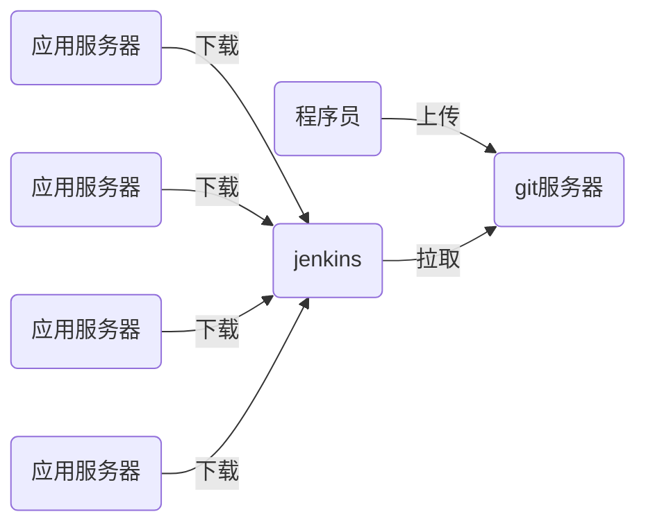

# nsd_1908_devops_day04

## CI/CD：持续集成/持续交付

编程语言：

- 解释执行：shell / python / php / javascript
- 编译执行：c / c++ / go / java



## git：开源的软件版本控制管理工具

### 准备git

将node4作为程序员编写代码的主机

```python
[root@node4 ~]# yum install -y git

# 命令补全功能需要安装的包
[root@node4 ~]# rpm -q bash-completion
bash-completion-2.1-6.el7.noarch

# 启用git的tab补全功能，可以重启系统，也可以采用以下方法
[root@node4 ~]# source /etc/bash_completion.d/git 

# 配置用户信息
[root@node4 ~]# git config --global user.name zzg
[root@node4 ~]# git config --global user.email zzg@tedu.cn
[root@node4 ~]# git config --global core.editor vim
[root@node4 ~]# git config --list 
user.name=zzg
user.email=zzg@tedu.cn
core.editor=vim
[root@node4 ~]# cat ~/.gitconfig 
[user]
	name = zzg
	email = zzg@tedu.cn
[core]
	editor = vim
```

## git的工作区域

- 工作区： 程序项目目录
- 暂存区：工作区与版本库之间的缓冲地带，.git/index
- 版本库：程序项目目录下的.git目录


### git应用

```shell
# 初始化git方法一
[root@node4 ~]# git init mytest
初始化空的 Git 版本库于 /root/mytest/.git/
[root@node4 ~]# ls -A mytest/
.git

# 初始化git方法二
[root@node4 ~]# mkdir myweb
[root@node4 ~]# cd myweb/
[root@node4 myweb]# echo '<h1>my web site</h1>' > index.html
[root@node4 myweb]# git init
初始化空的 Git 版本库于 /root/myweb/.git/
[root@node4 myweb]# ls -A
.git  index.html

# 查看状态
[root@node4 myweb]# git status 
[root@node4 myweb]# git status -s
?? index.html   # ??表示状态未知

# 将项目目录下所有内容加入到暂存区
[root@node4 myweb]# git add .
[root@node4 myweb]# git status
[root@node4 myweb]# git status -s
A  index.html  # A表示新增加的文件

# 提交到版本库
[root@node4 myweb]# git commit  # 跳出vim写日志，如果什么也不写，则不提交
[root@node4 myweb]# git commit -m "init project"
[root@node4 myweb]# git status
# 位于分支 master
无文件要提交，干净的工作区
[root@node4 myweb]# git status -s

# 将指定的文件加入跟踪
[root@node4 myweb]# cp /etc/hosts .
[root@node4 myweb]# cp /etc/passwd .
[root@node4 myweb]# ls
hosts  index.html  passwd
[root@node4 myweb]# git add hosts
[root@node4 myweb]# git commit -m "add hosts"

# 设置不需要通过git管理的文件
[root@node4 myweb]# vim .gitignore
*.swp
passwd
.gitignore
[root@node4 myweb]# git status
# 位于分支 master
无文件要提交，干净的工作区

# 将文件从暂存区中撤出
[root@node4 myweb]# cp /etc/issue .
[root@node4 myweb]# git add .
[root@node4 myweb]# git status
[root@node4 myweb]# git reset HEAD issue

# 恢复误删除的文件
[root@room8pc16 tmp]# du -sh nsd2019/
215M	nsd2019/
[root@room8pc16 tmp]# cd nsd2019/
[root@room8pc16 nsd2019]# rm -rf *
[root@room8pc16 nsd2019]# du -sh .
75M	.
[root@room8pc16 nsd2019]# ls -A
.git  .gitignore
[root@room8pc16 nsd2019]# git status | more
[root@room8pc16 nsd2019]# git checkout -- *
[root@room8pc16 nsd2019]# ls
ansible_project  nsd1902  nsd1905  nsd1908    review
ebooks           nsd1903  nsd1906  ppts       software
nsd1812          nsd1904  nsd1907  README.md

# 删除文件
[root@node4 myweb]# git add .
[root@node4 myweb]# git commit 'add issue'
[root@node4 myweb]# ls
hosts  index.html  issue  passwd
[root@node4 myweb]# git rm issue
[root@node4 myweb]# git status
[root@node4 myweb]# git commit -m "delete issue"
[root@node4 myweb]# git status

# 改名
[root@node4 myweb]# git mv hosts hosts.txt
[root@node4 myweb]# git status -s
R  hosts -> hosts.txt
[root@node4 myweb]# git commit -m "mv hosts hosts.txt"
[root@node4 myweb]# git status -s

# 切换到某一个commit点
[root@node4 myweb]# git log    # 找到add issue的确认点，复制其id号
[root@node4 myweb]# git status  # 工作区需要是干净的
# 位于分支 master
无文件要提交，干净的工作区
[root@node4 myweb]# git checkout \
2b60da12002b0fad328f4071a3fb7f49299ea5ad
[root@node4 myweb]# ls
hosts  index.html  issue  passwd

# 切换回最新状态
[root@node4 myweb]# git checkout master
[root@node4 myweb]# ls
hosts.txt  index.html  passwd

```

### 分支管理

- 默认情况下，git有一个名为master的分支
- 用户也可以创建自己的分支

```shell
# 查看分支
[root@node4 myweb]# git branch
* master

# 新建分支b1
[root@node4 myweb]# git branch b1
[root@node4 myweb]# git branch
  b1
* master   # 当前分支

# 在master分支上提交代码
[root@node4 myweb]# cp /etc/motd .
[root@node4 myweb]# git add .
[root@node4 myweb]# git commit -m "add motd"
[root@node4 myweb]# ls
hosts.txt  index.html  motd  passwd

# 切换分支
[root@node4 myweb]# git checkout b1
切换到分支 'b1'
[root@node4 myweb]# ls  # b1分支的工作区没有motd文件
hosts.txt  index.html  passwd

# 在b1上提交代码
[root@node4 myweb]# cp /etc/security/access.conf .
[root@node4 myweb]# git add .
[root@node4 myweb]# git commit -m "add access.conf"
[root@node4 myweb]# ls
access.conf  hosts.txt  index.html  passwd

# 将b1汇入主干
[root@node4 myweb]# git checkout master
[root@node4 myweb]# ls
hosts.txt  index.html  motd  passwd
[root@node4 myweb]# git merge b1 -m "merge b1"
[root@node4 myweb]# ls
access.conf  hosts.txt  index.html  motd  passwd

# 删除分支
[root@node4 myweb]# git branch -d b1
[root@node4 myweb]# git branch 
* master
```

### tag标记

```python
# 查看标记
[root@node4 myweb]# git tag

# 为当前提交打标记
[root@node4 myweb]# git tag 1.0
[root@node4 myweb]# git tag
1.0

# 继续编代码，提交。为新提交打标记
[root@node4 myweb]# echo '<h2>2nd version</h2>' >> index.html 
[root@node4 myweb]# git add .
[root@node4 myweb]# git commit -m "modify index.html"
[root@node4 myweb]# git tag 1.1
[root@node4 myweb]# git tag
1.0
1.1

```


