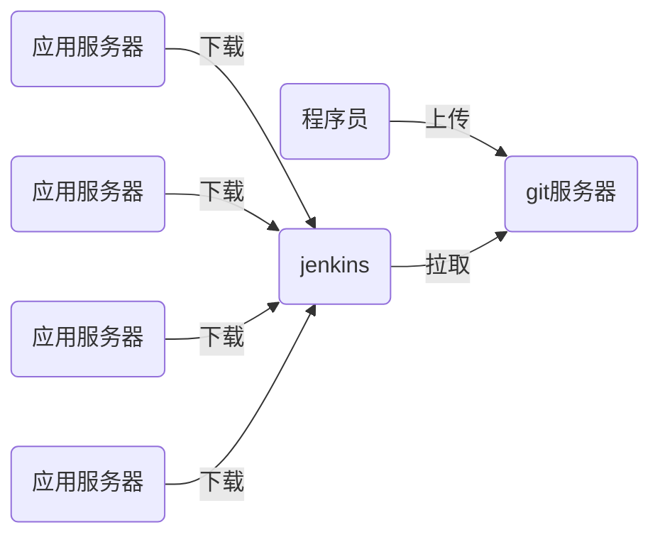

# nsd_1908_devops_day04

## CI/CD：持续集成/持续交付

编程语言：

- 解释执行：shell / python / php / javascript
- 编译执行：c / c++ / go / java



## git：开源的软件版本控制管理工具

### 准备git

```python
[root@node4 ~]# yum install -y git

# 命令补全功能需要安装的包
[root@node4 ~]# rpm -q bash-completion
bash-completion-2.1-6.el7.noarch

# 启用git的tab补全功能，可以重启系统，也可以采用以下方法
[root@node4 ~]# source /etc/bash_completion.d/git 

```


