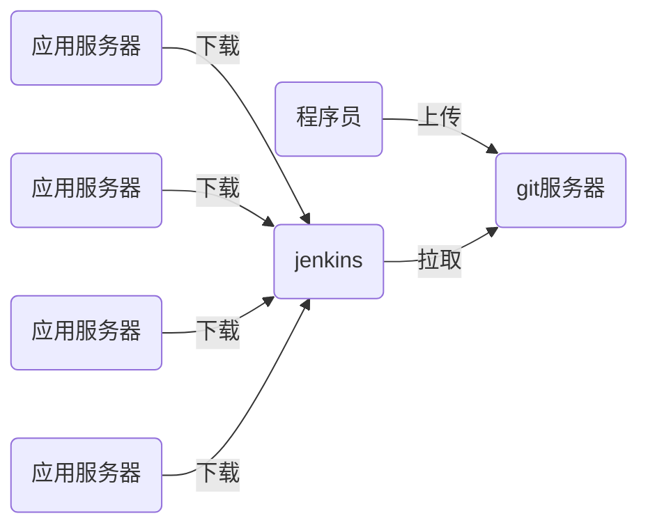

# nsd_1908_devops_day05



## 准备环境

- 准备一台可以连接互联网的虚拟机，安装jenkins
- jenkins基于java语言，所以虚拟机要安装java
- jenkins需要能与gitlab通信

```shell
[root@node6 ~]# rpm -ihv jenkins-2.190.1-1.1.noarch.rpm 
[root@node6 ~]# systemctl start jenkins
[root@node6 ~]# systemctl enable jenkins

```

### 安装

安装插件时选“无”，不要通过官方站点安装；创建用户时，选择右下角“使用admin继续登陆“。

安装完毕后，点击右上角的"admin" -> "config" -> "password"修改密码

### 使用国内镜像站点安装插件

首页 -> Manage Jenkins -> Manage Plugins -> Advanced -> Update Site: https://mirrors.tuna.tsinghua.edu.cn/jenkins/updates/update-center.json -> submit

Available -> 勾选Localization: Chinese(Simplified) 和 Git Parameter -> 点击Install Without Restart -> 勾选 Restart Jenkins when installation is complete and no jobs are running

### 创建工程

- 配置jenkins在gitlab上拉取代码

```shell
[root@node6 ~]# yum install -y git
```

首页 -> 创建新任务 -> 任务名myweb -> This project is parameterized(参数化构建) => 添加参数 => git parameter(git参数) => Name: webver / Parameter Type: Branch or Tag / Default Value: origin/master -> 源码管理 -> git => Repository URL: http://192.168.4.5/devops/myweb.git / Branches to build: $webver -> 保存

拉取代码：Build with Parameters -> 选择版本 -> 开始构建 。详情，可以点击左侧小圆球->控制台输出 

当执行任务后，代码将会拉取到/var/lib/jenkins/workspace/目录下

- 修改任务，将代码下载到不同的子目录

源码管理下面的 Additional Behaviours -> 新增 -> Check out to a sub-directory(检出到子目录) -> myweb-$webver -> 保存

- 修改任务，增加额外的构建步骤，实现的功能有
  - 将下载的代码打包
  - 将打包文件放到web服务器目录下，以便下载
  - 计算并存储压缩包的md5值，以便下载后检验
  - 将最新版本和前一版本写到版本文件中

```shell
[root@node6 ~]# yum install -y httpd
[root@node6 ~]# systemctl start httpd
[root@node6 ~]# systemctl enable httpd
[root@node6 ~]# mkdir -p /var/www/html/deploy/pkgs
[root@node6 ~]# chown -R jenkins.jenkins /var/www/html/deploy
```

修改项目，最下面 构建 -> 增加构建步骤 -> Execute shell(执行shell)

```shell
# 定义压缩包和md5文件的存储目录
pkg_dir=/var/www/html/deploy/pkgs
# 拷贝myweb-$webver到目标目录
cp -r myweb-$webver $pkg_dir
cd $pkg_dir
# 删除项目目录的版本库文件
rm -rf myweb-$webver/.git
# 把软件目录打包后删除软件目录
tar czf myweb-$webver.tar.gz myweb-$webver
rm -rf myweb-$webver
# 计算压缩包的md5值
md5sum myweb-$webver.tar.gz | awk '{print $1}' > \
myweb-$webver.tar.gz.md5
# 切换到上一级目录，生成前一版本文件last_ver和当前版本文件live_ver
cd ..
[ -f live_ver ] && cat live_ver > last_ver
echo -n $webver > live_ver
```

### 编写用于自动化部署的脚本

- /var/www/download/：用于存储下载的压缩包
- /var/www/deploy/：用于存储解压的目录和版本文件
- /var/www/html/nsd1908：指向软件目录的软链接


