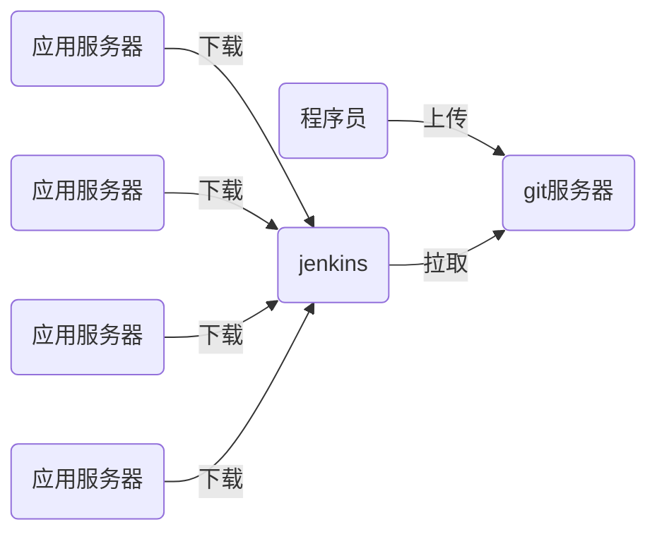

# nsd_1908_devops_day05



## 准备环境

- 准备一台可以连接互联网的虚拟机，安装jenkins
- jenkins基于java语言，所以虚拟机要安装java
- jenkins需要能与gitlab通信

```shell
[root@node6 ~]# rpm -ihv jenkins-2.190.1-1.1.noarch.rpm 
[root@node6 ~]# systemctl start jenkins
[root@node6 ~]# systemctl enable jenkins

```

### 安装

安装插件时选“无”，不要通过官方站点安装；创建用户时，选择右下角“使用admin继续登陆“。

安装完毕后，点击右上角的"admin" -> "config" -> "password"修改密码

### 使用国内镜像站点安装插件

首页 -> Manage Jenkins -> Manage Plugins -> Advanced -> Update Site: https://mirrors.tuna.tsinghua.edu.cn/jenkins/updates/update-center.json -> submit

Available -> 勾选Localization: Chinese(Simplified) 和 Git Parameter -> 点击Install Without Restart -> 勾选 Restart Jenkins when installation is complete and no jobs are running

### 创建工程

- 配置jenkins在gitlab上拉取代码

```shell
[root@node6 ~]# yum install -y git
```

首页 -> 创建新任务 -> 任务名myweb -> This project is parameterized(参数化构建) => 添加参数 => git parameter(git参数) => Name: webver / Parameter Type: Branch or Tag / Default Value: origin/master -> 源码管理 -> git => Repository URL: http://192.168.4.5/devops/myweb.git / Branches to build: $webver -> 保存

当执行任务后，代码将会拉取到/var/lib/jenkins/workspace/目录下


