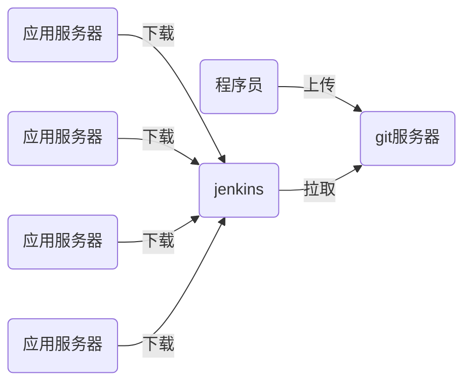

# nsd_1908_devops_day05

```mermaid
graph LR
dev(程序员)--上传-->git(git服务器)
j(jenkins)--拉取-->git
app1(应用服务器)--下载-->j
app2(应用服务器)--下载-->j
app3(应用服务器)--下载-->j
app4(应用服务器)--下载-->j
```

## 准备环境

- 准备一台可以连接互联网的虚拟机，安装jenkins
- jenkins基于java语言，所以虚拟机要安装java
- jenkins需要能与gitlab通信

